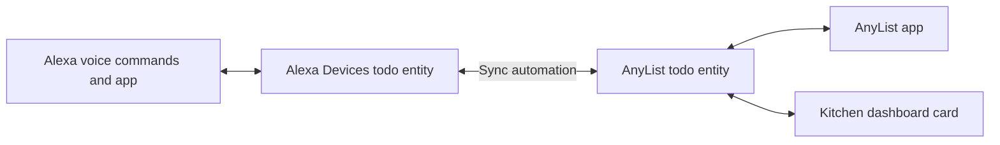

# Sync AnyList, Alexa, and a Home Assistant shopping list card

I use Alexa to add groceries by voice, AnyList while shopping, and a card on my kitchen dashboard to check items off at home. This guide shows how I connect all three, using my Home Assistant automation and kitchen card configuration.

The setup has two shopping lists and three places to use them. **Alexa Devices** exposes the Alexa list in Home Assistant, this **AnyList integration** exposes the AnyList list, and an automation copies changes between them. The dashboard card reads and updates the AnyList list directly.




*My shopping list card layout: compact item buttons with separators between category groups.*

## What to install first

1. **Home Assistant 2026.7 or later.** Alexa shopping list support is included from this version. See the [Home Assistant 2026.7 release notes](https://www.home-assistant.io/blog/2026/07/01/release-20267/).
2. **Alexa Devices, configured with your Amazon account.** Go to **Settings → Devices & services → Add integration → Alexa Devices**. This is the integration that provides the Alexa shopping list as a `todo` entity. Follow the [Alexa Devices setup instructions](https://www.home-assistant.io/integrations/alexa_devices/), including its requirement for an authenticator app as the preferred two-factor authentication method. Confirm that the shopping list entity is available before continuing.
3. **AnyList for Home Assistant.** Follow the [installation and configuration instructions](../README.md#installation), sign in, and select the AnyList list you want to sync. Confirm that its `todo` entity is available and has the `items_signature` and `items_by_category` attributes in **Developer tools → States**.
4. **TailwindCSS Template Card**, for the category-based card shown here. Follow the [card's installation instructions](https://github.com/usernein/tailwindcss-template-card#installation). Its HACS instructions use a custom dashboard repository. Install it and reload your browser before adding the card. The synchronization automation works independently of this card.

## Choose the two lists

I use these readable example entity IDs throughout the guide:

| Example entity ID | Integration | Purpose |
| --- | --- | --- |
| `todo.alexa_shopping_list` | Alexa Devices | The shopping list used by Alexa |
| `todo.anylist_shopping_list` | AnyList | The AnyList list used by the automation and dashboard |

Find your actual IDs on each integration's entity page or in **Developer tools → States**. Check the integration that owns each entity, since a list's display name can be misleading.

**Replace every occurrence of both example IDs in all the YAML below**, including IDs inside templates, HTML, and JavaScript. Changing only the variables at the top of the automation is insufficient: the availability checks and dashboard actions also contain entity IDs.

Before enabling synchronization, make both lists contain the items and completion states you want to keep. **Each run makes the destination match the selected source, including removing destination-only items.** It does not merge two independently maintained lists. The refresh button and optional startup automation select Alexa as the source, so keep that in mind when first connecting an existing AnyList list.

## How changes move between the three interfaces

| Where I make a change | What happens |
| --- | --- |
| Add or check off an item through Alexa | When Home Assistant sees the unfinished-item count change, the automation reads Alexa and makes AnyList match. The card redraws from AnyList. |
| Add, delete, rename, check, or uncheck an item in AnyList | When the integration sees a changed content signature, the automation makes Alexa match. The card reads the same AnyList entity. |
| Tap an item on the kitchen card | The card calls `todo.update_item` on AnyList. Its changed signature triggers synchronization to Alexa. |
| Tap the card's refresh button | The card requests updates from Alexa and AnyList, then fires an event that selects Alexa as the source. |

The automation copies **item names and completion states**. Categories stay on the AnyList side and control the card's grouping. It does not copy separate quantity fields, notes, due dates, or category metadata between the services. For a quantity that must be visible in both lists, I put it in the name, such as `milk x2`.

The AnyList integration polls every 60 seconds by default and requests a refresh after changes made through Home Assistant. You can set **Polling Interval** in the integration options to a value from 60 to 3600 seconds. An edit in the AnyList app can therefore take up to one configured polling interval to reach Home Assistant. Alexa Devices receives shopping list changes through push events, according to its [data update documentation](https://www.home-assistant.io/integrations/alexa_devices/#data-updates); actual delivery still depends on the connection and service.

### A concrete comparison

Suppose Alexa triggers a run with this list:

| Item | Alexa, the source | AnyList, before synchronization | Automation action |
| --- | --- | --- | --- |
| `milk` | Needs action | Missing | Add `milk` to AnyList. |
| `bread` | Completed | Needs action | Mark the existing AnyList item completed. |
| `eggs` | Missing | Needs action | Remove the AnyList item. |
| `apples` | Needs action | Needs action | Leave it alone. |

After the run, the card shows milk and apples as active and bread crossed out. Eggs is gone. If I tap bread on the card, it becomes active in AnyList, and an AnyList-source run changes Alexa's bread item back to `needs_action`.

The same add, remove, and completion rules work in the opposite direction when AnyList triggers. If a missing source item is already completed, the automation first adds it to the destination and then marks it completed.

## Add the synchronization automation

Create a new empty automation under **Settings → Automations & scenes**, open **Edit in YAML**, and paste the complete example below. Replace the entity IDs before saving.

This is a single automation object for the UI editor. If you maintain `automations.yaml` directly, add it as a list entry with a unique `id` and the appropriate indentation.

I kept the behavior of my running automation, including its health checks. The example uses readable entity IDs and omits my installation's automation ID.

```yaml
alias: Shopping List Sync | Alexa Todo <-> AnyList
description: |
  Two-way sync between the Alexa Devices shopping list todo.alexa_shopping_list and the AnyList shopping list todo.anylist_shopping_list. Source of truth is whichever side triggered. The startup refresh automation fires a local event that treats Alexa as the source after Home Assistant starts.
triggers:
  - alias: Alexa todo changed - Alexa is the source
    entity_id:
      - todo.alexa_shopping_list
    id: alexa_source
    trigger: state
  - alias: AnyList todo changed - AnyList is the source
    entity_id:
      - todo.anylist_shopping_list
    id: anylist_source
    trigger: state
    attribute: items_signature
  - alias: Startup refresh requested - Alexa is the source
    event_type: shopping_list_sync_alexa_source_requested
    id: alexa_source
    trigger: event
conditions:
  - alias: Accept only healthy shopping-list content-change triggers
    condition: template
    value_template: |-
      
        true
      
        false
      
        false
      
        
        
        {{ old_signature is not none
           and new_signature is not none
           and old_signature != new_signature }}
      
        {{ trigger.from_state.state != trigger.to_state.state }}
      
        false
      
actions:
  - alias: Define shopping list sync entities
    variables:
      alexa_todo_entity: todo.alexa_shopping_list
      anylist_todo_entity: todo.anylist_shopping_list
      sync_destination_entity: |-
        {{ 'todo.anylist_shopping_list' if trigger.id == 'alexa_source'
           else 'todo.alexa_shopping_list' }}
  - alias: Wait for both shopping list entities to become readable
    wait_template: |-
      {{ has_value('todo.alexa_shopping_list')
         and has_value('todo.anylist_shopping_list')
         and state_attr('todo.anylist_shopping_list', 'items_signature') is not none }}
    timeout: 00:10:00
    continue_on_timeout: true
  - alias: Stop if either shopping list entity did not become readable
    if:
      - alias: Check both todo entities are readable before syncing
        condition: template
        value_template: |-
          {{ not has_value('todo.alexa_shopping_list')
             or not has_value('todo.anylist_shopping_list')
             or state_attr('todo.anylist_shopping_list', 'items_signature') is none }}
    then:
      - alias: Stop because one side did not recover before the timeout
        stop: Shopping list todo entity did not become readable before the timeout
  - alias: Refresh AnyList before Alexa-source comparisons
    choose:
      - alias: Alexa is source, so refresh AnyList before comparing lists
        conditions:
          - alias: Continue only when Alexa triggered the sync
            condition: template
            value_template: '{{ trigger.id == ''alexa_source'' }}'
        sequence:
          - alias: Refresh AnyList data from the integration
            action: anylist.refresh
            data: {}
            continue_on_error: true
          - alias: Give AnyList refresh a few seconds to settle
            delay: 00:00:03
          - alias: Wait for both shopping lists after the AnyList refresh
            wait_template: |-
              {{ has_value('todo.alexa_shopping_list')
                 and has_value('todo.anylist_shopping_list')
                 and state_attr('todo.anylist_shopping_list', 'items_signature') is not none }}
            timeout: 00:10:00
            continue_on_timeout: true
          - alias: Stop if AnyList did not recover after refresh
            if:
              - condition: template
                value_template: |-
                  {{ not has_value('todo.alexa_shopping_list')
                     or not has_value('todo.anylist_shopping_list')
                     or state_attr('todo.anylist_shopping_list', 'items_signature') is none }}
            then:
              - stop: AnyList did not recover after refresh
  - alias: Read all active and completed items from both shopping lists
    action: todo.get_items
    target:
      entity_id:
        - todo.alexa_shopping_list
        - todo.anylist_shopping_list
    data:
      status:
        - needs_action
        - completed
    response_variable: shopping_lists_response
  - alias: Stop unless both shopping list snapshots were returned completely
    if:
      - condition: template
        value_template: |-
           
            true
          
            true
          
            
            
            
              true
            
              
              
              {{ 'items' not in alexa_response
                 or 'items' not in anylist_response
                 or alexa_items is not iterable
                 or anylist_items is not iterable
                 or alexa_items is mapping
                 or anylist_items is mapping
                 or alexa_items is string
                 or anylist_items is string
                 or not has_value('todo.alexa_shopping_list')
                 or not has_value('todo.anylist_shopping_list')
                 or state_attr('todo.anylist_shopping_list', 'items_signature') is none }}
            
          
    then:
      - stop: todo.get_items did not return two complete healthy list snapshots
  - alias: Normalize Alexa and AnyList items into comparable JSON lists
    variables:
      alexa_items_json: |-
          
          
          
            
          
         {{ ns.items | to_json }}
      anylist_items_json: |-
          
          
          
            
          
         {{ ns.items | to_json }}
      source_items_json: '{{ alexa_items_json if trigger.id == ''alexa_source'' else anylist_items_json }}'
      destination_items_json: '{{ anylist_items_json if trigger.id == ''alexa_source'' else alexa_items_json }}'
      source_signature: |-
          
          
         {{ ns.vals | join(',') }}
      destination_signature: |-
          
          
         {{ ns.vals | join(',') }}
  - alias: Stop when both sides already contain the same items and completion states
    if:
      - alias: Compare source and destination signatures
        condition: template
        value_template: '{{ source_signature == destination_signature }}'
    then:
      - alias: Stop because no sync changes are needed
        stop: Lists already synchronized
  - alias: Calculate destination additions, removals, and completion updates
    variables:
      destination_add_json: |-
           
          
            
          
         {{ ns.items | to_json }}
      destination_remove_json: |-
           
          
            
          
         {{ ns.items | to_json }}
      destination_update_json: |-
           
          
          
            
          
         {{ ns.items | to_json }}
  - alias: Add items that exist in the source but not the destination
    repeat:
      for_each: '{{ destination_add_json | from_json(default=[]) }}'
      sequence:
        - alias: Stop if either list is unhealthy before adding an item
          if:
            - condition: template
              value_template: |-
                {{ not has_value('todo.alexa_shopping_list')
                   or not has_value('todo.anylist_shopping_list')
                   or state_attr('todo.anylist_shopping_list', 'items_signature') is none }}
          then:
            - stop: Shopping list became unhealthy before adding an item
        - alias: Add missing item to destination list
          action: todo.add_item
          target:
            entity_id: '{{ sync_destination_entity }}'
          data:
            item: '{{ repeat.item.summary }}'
        - alias: Mark newly added destination item completed when the source item is completed
          if:
            - alias: Check whether the source item is completed
              condition: template
              value_template: '{{ repeat.item.completed }}'
          then:
            - alias: Stop if either list is unhealthy before completing the new item
              if:
                - condition: template
                  value_template: |-
                    {{ not has_value('todo.alexa_shopping_list')
                       or not has_value('todo.anylist_shopping_list')
                       or state_attr('todo.anylist_shopping_list', 'items_signature') is none }}
              then:
                - stop: Shopping list became unhealthy before completing the new item
            - alias: Set the newly added destination item to completed
              action: todo.update_item
              target:
                entity_id: '{{ sync_destination_entity }}'
              data:
                item: '{{ repeat.item.summary }}'
                status: completed
  - alias: Remove destination items that no longer exist in the source
    repeat:
      for_each: '{{ destination_remove_json | from_json(default=[]) }}'
      sequence:
        - alias: Stop if either list is unhealthy before removing an item
          if:
            - condition: template
              value_template: |-
                {{ not has_value('todo.alexa_shopping_list')
                   or not has_value('todo.anylist_shopping_list')
                   or state_attr('todo.anylist_shopping_list', 'items_signature') is none }}
          then:
            - stop: Shopping list became unhealthy before removing an item
        - alias: Remove extra item from destination by UID
          action: todo.remove_item
          target:
            entity_id: '{{ sync_destination_entity }}'
          data:
            item: '{{ repeat.item.uid | default(repeat.item.summary, true) }}'
  - alias: Update destination completion states to match the source
    repeat:
      for_each: '{{ destination_update_json | from_json(default=[]) }}'
      sequence:
        - alias: Stop if either list is unhealthy before updating an item
          if:
            - condition: template
              value_template: |-
                {{ not has_value('todo.alexa_shopping_list')
                   or not has_value('todo.anylist_shopping_list')
                   or state_attr('todo.anylist_shopping_list', 'items_signature') is none }}
          then:
            - stop: Shopping list became unhealthy before updating an item
        - alias: Set destination item status to completed or needs_action
          action: todo.update_item
          target:
            entity_id: '{{ sync_destination_entity }}'
          data:
            item: '{{ repeat.item.uid | default(repeat.item.summary, true) }}'
            status: '{{ ''completed'' if repeat.item.completed else ''needs_action'' }}'
mode: queued
max: 10
```

### What the checks do

1. **Accept meaningful triggers.** State changes from or to `unknown` or `unavailable` are rejected. AnyList must have an old and new `items_signature`, and they must differ. Alexa must have a changed numeric state, which represents its unfinished-item count. The custom event also starts a run.
2. **Wait for readable entities.** A run waits up to ten minutes for both entities and the AnyList signature to be available, then stops if they are still unreadable.
3. **Refresh AnyList for an Alexa-source run.** The automation calls `anylist.refresh`, waits three seconds, and checks readiness again, with another wait of up to ten minutes. The refresh action allows an error so the recovery checks can run; this is not a guarantee of a successful cloud refresh.
4. **Read both complete responses.** `todo.get_items` requests active and completed items. Both entities must appear in the response with an iterable `items` collection, and the entities must still be healthy. A missing response is not treated as an empty list. A valid empty list can still cause removal of all destination items.
5. **Compare normalized contents.** Names are trimmed and lowercased for matching. A signature combines the names and checked states in sorted order. Equal signatures stop the run without writes.
6. **Apply only the differences.** The automation adds missing items, removes destination-only items, and changes mismatched completion states. It checks health before each write and uses the destination item's UID for removal and status updates when available.

`mode: queued` with `max: 10` makes accepted runs execute in order. Writes can trigger another run; once the lists match, that run should stop at the signature comparison. This reduces unnecessary writes, but it does not provide a transaction across the two services or resolve simultaneous edits.

### Matching and trigger limits

- **Alexa changes that keep the count unchanged can be missed.** An Alexa rename, deletion of an already completed item, or multiple changes arriving with the same final unfinished-item count will not pass the Alexa state condition. The card's refresh button requests an explicit Alexa-source comparison for those cases.
- **An availability recovery alone does not trigger reconciliation.** The automation rejects transitions from `unavailable` or `unknown`. A later accepted content change or explicit refresh event can start another comparison.
- **Names identify items across services.** `Milk` and ` milk ` match. A substantive rename is handled as an addition and a removal; changing only capitalization or surrounding spaces is ignored by the comparison.
- **Use distinct names.** The automation does not reconcile duplicate items with the same normalized name or clean them up automatically. It can leave duplicates or ambiguous completion matches. I use names such as `milk x2` when I need more than one of something.
- **Edit one interface at a time during synchronization.** The trigger chooses the source, and the lists are read when that queued run executes. There is no per-item edit timestamp or conflict merge. Concurrent edits or a failed run after some successful writes can leave differences that require another comparison.

## Optional: synchronize after Home Assistant starts

I also use this separate startup automation. It waits 90 seconds, requests an Alexa entity update, waits another three seconds, and fires `shopping_list_sync_alexa_source_requested`.

**Alexa is the source for this startup comparison.** Enable it when that matches how you want to recover after a restart. It can remove AnyList-only items or overwrite their completion states to match Alexa.

Create another empty automation and paste this YAML after replacing the Alexa entity ID:

```yaml
alias: Shopping List - refresh after Home Assistant start
description: Refresh the native Alexa todo list after startup, then ask the shopping list sync automation to treat
  Alexa as the source.
triggers:
  - event: start
    trigger: homeassistant
actions:
  - delay: 00:01:30
  - alias: Refresh Alexa shopping list todo entity
    action: homeassistant.update_entity
    target:
      entity_id: todo.alexa_shopping_list
    continue_on_error: true
  - delay: 00:00:03
  - alias: Request Alexa-to-AnyList shopping list sync
    event: shopping_list_sync_alexa_source_requested
    event_data:
      source: homeassistant_start
mode: single
```

The startup refresh uses `continue_on_error: true`, so the event is still sent if that refresh action fails. The main automation then applies its availability and response checks. It can wait for readable entities, but it cannot prove that Alexa returned the latest cloud contents.

## Add the kitchen dashboard card

The card reads `items_by_category` from the AnyList entity. Each group contains its category name and items with `uid`, `name`, and `status` fields. The integration supplies the category order, with Uncategorized at the end.

The card places a vertical separator between nonempty groups. It displays item names without category headings, and keeps completed items visible with a strikethrough and lower opacity. Tapping a completed item unchecks it again.


*Tapping an item toggles its completion state. The screenshots illustrate the grouping and checked appearance; colors and emoji rendering depend on the dashboard theme and browser.*

Edit your dashboard, choose **Add card → Manual**, and paste the following configuration. Replace both entity IDs everywhere in the card.

```yaml
type: custom:tailwindcss-template-card
entity: todo.anylist_shopping_list
content: |-
  <div class="flex flex-wrap gap-2 justify-center p-2">
    
    
    
    
      
    

    <div class="bg-accent rounded-lg p-3">
      <div
        onclick="
          hass.callService('homeassistant', 'update_entity', {entity_id: 'todo.alexa_shopping_list'});
          hass.callService('anylist', 'refresh', {});
          setTimeout(() => hass.callApi('POST', 'events/shopping_list_sync_alexa_source_requested', {source: 'dashboard_kitchen'}), 1500);
        "
        class="hover:scale-105 transition-all cursor-pointer"
        style="font-size:14px;"
      >
        🛒📋🔃
      </div>
    </div>

    
      <div class="self-center px-1" style="font-size:28px; line-height:1; opacity:0.35;">|</div>
    

    
      <div class="bg-accent rounded-lg p-3">
        <span style="font-size:14px;">Shopping list is empty</span>
      </div>
    
      

      
        
        
          
            <div class="self-center px-1" style="font-size:28px; line-height:1; opacity:0.35;">|</div>
          
            
          

          
            
            
              
              
              
              
              

              <div
                class="bg-accent rounded-lg p-3 cursor-pointer hover:scale-105 transition-all"
                style="opacity: {{ opacity }};"
                data-item="{{ todo_item | e }}"
                data-next-status="{{ next_status }}"
                onclick="hass.callService('todo', 'update_item', {entity_id: 'todo.anylist_shopping_list', item: this.dataset.item, status: this.dataset.nextStatus});"
              >
                <span style="font-size:14px; text-decoration: {{ text_decoration }};">
                  {{ item_name_display }}
                </span>
              </div>
            
          
        
      
    
  </div>
ignore_line_breaks: true
always_update: false
parse_jinja: true
code_editor: Ace
entities:
  - todo.anylist_shopping_list
bindings: []
actions: []
debounceChangePeriod: 100
plugins:
  daisyui:
    enabled: true
    url: https://cdn.jsdelivr.net/npm/daisyui@latest/dist/full.css
    theme: dark - dark
    overrideCardBackground: false
  tailwindElements:
    enabled: false
```

### What happens when I tap an item

The card puts the item's UID into `data-item` and the next state into `data-next-status`. Its click handler calls:

```javascript
hass.callService('todo', 'update_item', {
  entity_id: 'todo.anylist_shopping_list',
  item: this.dataset.item,
  status: this.dataset.nextStatus
});
```

AnyList changes the item's state and refreshes the entity. The updated `items_signature` starts the AnyList-source automation, which changes the matching Alexa item. The card itself provides completion toggles and refresh; I add groceries through Alexa or the AnyList app.

### What the refresh button does

The first button contains the shopping cart, clipboard, and refresh symbols. It requests `homeassistant.update_entity` for Alexa and `anylist.refresh`, then schedules the custom sync event after 1.5 seconds.

That event makes Alexa authoritative for the comparison. It is an explicit Alexa-to-AnyList sync request, so I use it when Alexa contains the list I want to keep. The JavaScript starts the two refresh calls without awaiting their completion; the fixed delay is not a confirmation that both requests finished. The main automation still performs its own AnyList refresh and health checks. The card has no loading or success indicator.

The supplied styling enables DaisyUI using its public CDN URL, so the browser needs access to that stylesheet. The empty message means the card has no grouped items to render; it is not an integration health indicator.

## Check the setup

Start with matching lists, then try these steps one at a time, allowing each change to finish before the next:

1. Say **“Alexa, add sync test apples to my shopping list.”** Confirm that the item appears in Alexa, then AnyList, then the card.
2. Tap that item on the card. Confirm that it is crossed out in AnyList and marked completed in Alexa.
3. Tap it again. Confirm that both lists return it to active.
4. Add **sync test bread** in the AnyList app. Allow the normal polling interval, then confirm it reaches Alexa and the card.
5. Remove that active test item in AnyList. Confirm it disappears from Alexa as well.
6. With Alexa holding the desired contents, tap the refresh button. Open the sync automation's **Traces** and check that the trigger selected `alexa_source` and that the run either applied differences or stopped with `Lists already synchronized`.

Use a real trigger or the refresh button for this check. The automation relies on `trigger.id`, `trigger.platform`, and state-trigger details, so **Run actions** alone does not supply the context it expects.

## Troubleshooting

| Symptom | What I check |
| --- | --- |
| No Alexa shopping list entity | Confirm that Alexa Devices is configured successfully and that Home Assistant supports its to-do platform. Check its integration page for authentication or connection errors. |
| The automation stops because a list is unreadable | Inspect both entities in Developer tools. AnyList needs an `items_signature` as well as an available state. Read the trace's stop reason and the integration logs. |
| AnyList app changes take time | Allow one configured polling interval (60 seconds by default). To refresh only AnyList, call `anylist.refresh` in Developer tools → Actions. The card's refresh button additionally selects Alexa as the sync source. |
| An Alexa rename does not reach AnyList | The unfinished count may be unchanged. When Alexa holds the desired list, use the card's explicit refresh. |
| Items disappear after refresh or restart | Check the selected source. The automation removes destination-only entries, and both refresh paths select Alexa. |
| Items appear twice or completion states disagree | Check for repeated names after trimming and lowercasing. Use unique names in each list. |
| The card says “Shopping list is empty” despite items in AnyList | Check the card's entity IDs and the actual `items_by_category` attribute. Missing grouped data also renders as empty. |
| “Custom element doesn't exist” | Check that TailwindCSS Template Card is installed and its dashboard resource loaded, then reload the browser. |
| Items synchronize but category groups seem wrong | Inspect their categories in AnyList and `items_by_category`. The card uses AnyList's categories; the sync automation does not assign them. Known items added through the integration can reuse AnyList's learned category assignments. |
